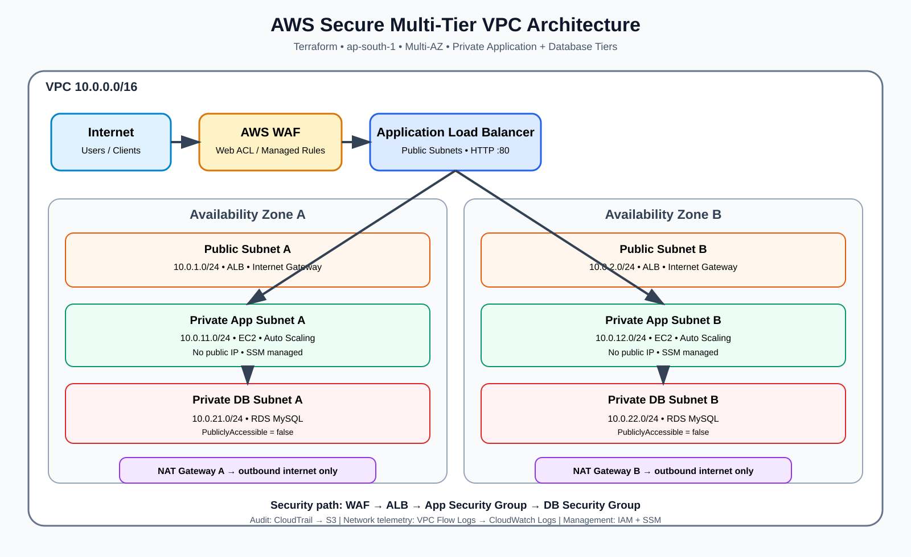

# AWS Secure Multi-Tier VPC with Automated Security Controls

A production-style AWS networking and security lab built with Terraform. The project uses a multi-AZ three-tier architecture, private EC2 application servers, private RDS MySQL, an internet-facing ALB protected by AWS WAF, and centralized audit/network logging.

## Architecture at a glance



### Traffic path

`Internet → AWS WAF → Public ALB → Private EC2 Auto Scaling Group → Private RDS MySQL`

Private application instances use NAT Gateways for outbound internet access and do not receive public IP addresses. CloudTrail records AWS API activity to S3, while VPC Flow Logs are delivered to CloudWatch Logs.

## What was actually deployed

| Layer | AWS resources | Purpose |
|---|---|---|
| Network | VPC `10.0.0.0/16` | Isolated network boundary |
| Availability | 2 Availability Zones | Fault isolation and resilience |
| Public tier | 2 public subnets, IGW | Internet-facing networking |
| Private app tier | 2 private subnets, EC2 x2, ASG | Application workload |
| Database tier | 2 private subnets, RDS MySQL | Private data layer |
| Egress | NAT Gateway x2 + EIPs | Private outbound internet access |
| Perimeter | ALB + AWS WAF | Controlled public entry point |
| Identity | IAM role + SSM | Manage private EC2 without public SSH |
| Audit | CloudTrail + S3 | AWS API auditing |
| Network telemetry | VPC Flow Logs + CloudWatch | Network traffic metadata |

## Security design

### 1. Network segmentation

The VPC is split into public, private application, and private database subnet tiers. This limits the blast radius of an exposed component and prevents the database layer from becoming directly internet reachable.

### 2. Security-group chaining

The intended trust path is:

```text
Internet
  ↓
ALB Security Group
  ↓
App Security Group
  ↓
DB Security Group
```

The application servers accept application traffic from the ALB security group. The database accepts MySQL traffic from the application security group.

### 3. Private compute

The two EC2 instances run in private subnets and were verified with no public IPs. They are managed through AWS Systems Manager using an IAM instance profile.

### 4. Private database

RDS MySQL runs in the private DB subnets with `PubliclyAccessible = false`.

### 5. Web-layer protection

AWS WAF is associated with the ALB and includes AWS managed common-rule protection plus IP-based rate limiting.

### 6. Audit and network visibility

CloudTrail provides API-level auditability and stores logs in an S3 bucket with public access blocked. VPC Flow Logs record network traffic metadata to a CloudWatch log group with a 7-day retention period.

## Repository structure

```text
aws-secure-vpc/
├── terraform/
│   ├── provider.tf
│   ├── variables.tf
│   ├── vpc.tf
│   ├── nat.tf
│   ├── security.tf
│   ├── iam.tf
│   ├── ec2.tf
│   ├── asg.tf
│   ├── alb.tf
│   ├── rds.tf
│   ├── waf.tf
│   ├── cloudtrail.tf
│   └── flow-logs.tf
├── docs/
│   └── architecture.md
├── diagrams/
│   └── aws-secure-vpc-architecture.svg
├── lambda/
├── scripts/
└── README.md
```

## Prerequisites

You can reproduce the project on another Windows, Linux, or macOS system with:

- AWS account
- AWS CLI
- Terraform >= 1.6
- Git
- An AWS identity permitted to create the required resources

### 1. Configure AWS credentials

Configure the AWS CLI with a dedicated IAM identity rather than embedding credentials in Terraform:

```bash
aws configure
```

Use `ap-south-1` for the default region in this lab.

Verify the identity:

```bash
aws sts get-caller-identity
```

### 2. Clone the repository

```bash
git clone https://github.com/ankityadav1asia/aws-secure-vpc.git
cd aws-secure-vpc
```

### 3. Initialize Terraform

```bash
cd terraform
terraform init
```

### 4. Validate

```bash
terraform fmt -recursive
terraform validate
```

### 5. Configure variables

Create `terraform.tfvars` locally. **Do not commit it.** Example:

```hcl
aws_region   = "ap-south-1"
project_name = "ankit-secure-vpc"
environment  = "dev"
db_password  = "REPLACE_WITH_A_STRONG_LOCAL_PASSWORD"
```

The repository `.gitignore` excludes `terraform.tfvars`, Terraform state, and `.terraform/`.

### 6. Preview

```bash
terraform plan
```

### 7. Deploy

```bash
terraform apply
```

Review the proposed resource changes and type `yes` only when they match the expected architecture.

## Useful verification commands

### EC2 instances

```powershell
aws ec2 describe-instances --filters "Name=tag:Name,Values=ankit-secure-vpc-app-server" --query "Reservations[].Instances[].[InstanceId,State.Name,PrivateIpAddress,PublicIpAddress]" --output table
```

Expected: two running instances with private IPs and no public IPs.

### RDS

```powershell
aws rds describe-db-instances --db-instance-identifier ankit-secure-vpc-mysql --query "DBInstances[0].[DBInstanceIdentifier,DBInstanceStatus,Engine,PubliclyAccessible]" --output table
```

Expected: `available`, `mysql`, `False`.

### VPC Flow Logs

```powershell
aws ec2 describe-flow-logs --query "FlowLogs[].[FlowLogId,FlowLogStatus,ResourceId,LogDestination]" --output table
```

Expected: `ACTIVE`.

### CloudTrail

```powershell
aws cloudtrail get-trail --name ankit-secure-vpc-trail --query "Trail.[Name,IsMultiRegionTrail,LogFileValidationEnabled,S3BucketName]" --output table
```

Expected: multi-region enabled and log-file validation enabled.

## HTTPS note

The current lab uses an HTTP ALB listener on port 80. Public HTTPS requires a domain name and an ACM certificate with validation. That can be added as a separate improvement without changing the private-network design.

## Cost control

This is a lab environment. NAT Gateways, RDS, ALB, WAF and logging services can incur charges while provisioned. When the lab is finished, destroy the Terraform-managed infrastructure:

```bash
terraform destroy
```

Do not commit AWS credentials, database passwords, Terraform state, or `.terraform/` to GitHub.

## Learning outcomes

This project demonstrates hands-on experience with:

- AWS VPC and subnet design
- Multi-AZ architecture
- Route tables and NAT Gateways
- Security-group least-privilege patterns
- EC2 and Auto Scaling
- Application Load Balancing
- RDS private networking
- AWS WAF
- IAM and Systems Manager
- CloudTrail
- VPC Flow Logs and CloudWatch
- Terraform Infrastructure as Code
- Git/GitHub workflows

## Author

Ankit Yadav
